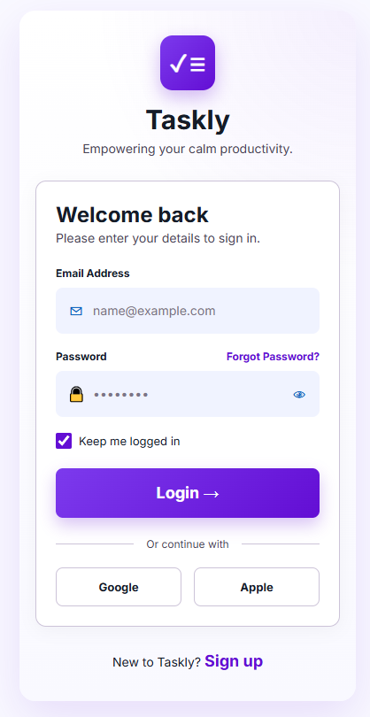
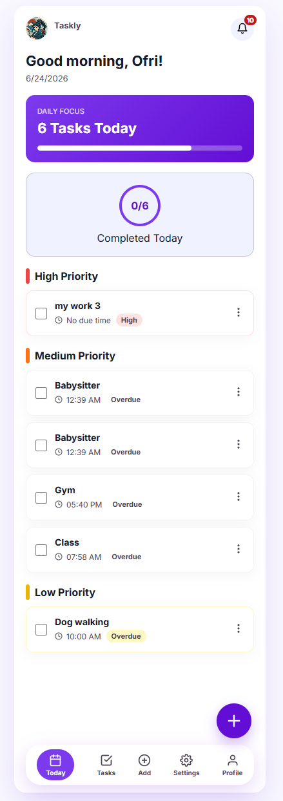
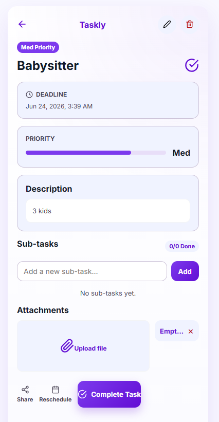
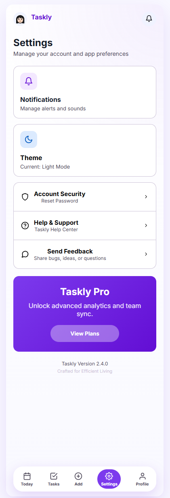

# Taskly

Taskly is a modern task management web application built with React, Vite, Supabase, and Vercel.

The application helps users organize daily tasks, manage priorities, track progress, upload attachments, and stay productive through a clean and intuitive interface.

## Live Demo

🔗 https://taskly-tan-gamma.vercel.app

## GitHub Repository

🔗 https://github.com/OfriCohen/Taskly

---

# Problem Statement

Many people manage their daily tasks using scattered solutions such as notes, WhatsApp messages, spreadsheets, or memory alone.

These approaches make it difficult to stay organized, monitor progress, manage deadlines, and keep task-related information in one place.

Taskly solves this problem by providing a centralized task management platform where users can create tasks, assign priorities, track completion, manage subtasks, upload attachments, and review their progress through a personalized dashboard.

---

# Target Audience

Taskly is designed for:

- Students managing assignments and deadlines
- Employees organizing daily work tasks
- Freelancers tracking projects and personal responsibilities
- Individuals looking for a simple productivity tool

Users typically interact with the system throughout the day to create tasks, update progress, complete activities, and review upcoming deadlines.

---

# Competitors and Differentiation

## Existing Solutions

- Microsoft To Do
- Todoist
- Google Tasks
- Trello
- Notion
- Excel spreadsheets
- WhatsApp self-messaging
- Paper notes and manual tracking

## Why Taskly is Different

Taskly focuses on simplicity while still providing advanced task management capabilities.

Key differentiators include:

- Task priorities (Low / Medium / High)
- Subtask management
- File attachments for tasks
- Personalized dashboard with progress tracking
- User profile management
- Built-in feedback system
- Mobile-first responsive design
- Secure cloud storage with Supabase
- Simple and intuitive user experience

---

# Main Features

- User registration and authentication
- Secure login and logout
- Password reset functionality
- Protected routes
- Task creation
- Task editing
- Task completion tracking
- Task deletion
- Priority management
- Subtask management
- File attachments
- Personal profile page
- Settings page
- Dark mode support
- Notification preferences
- Help & Support page
- Pricing page
- Feedback submission system
- Analytics tracking
- Session recording with Microsoft Clarity

---

# Screenshots

### Login Screen



### Today Dashboard



### Task Details



### Settings Page



---

# Technologies Used

### Frontend

- React
- Vite
- React Router
- CSS
- React Icons

### Backend

- Supabase Authentication
- Supabase Database
- Supabase Storage

### Deployment & Analytics

- Vercel
- Vercel Analytics
- Microsoft Clarity

### Version Control

- GitHub

---

# Database Structure

The application uses Supabase as its backend database.

Main tables:

### profiles

Stores user profile information.

### tasks

Stores user tasks and task details.

### sub_tasks

Stores subtasks associated with tasks.

### task_attachments

Stores files uploaded to tasks.

### feedback

Stores user feedback messages.

---

# Entity Relationships

- One User → One Profile
- One User → Many Tasks
- One Task → Many Subtasks
- One Task → Many Attachments
- One User → Many Feedback Messages

---

# External Services

| Service           | Type           | Purpose                         |
| ----------------- | -------------- | ------------------------------- |
| Supabase Auth     | Authentication | User registration and login     |
| Supabase Database | Backend        | Stores application data         |
| Supabase Storage  | File Storage   | Stores uploaded files           |
| Vercel            | Hosting        | Deploys the application         |
| Vercel Analytics  | Analytics      | Tracks visitor activity         |
| Microsoft Clarity | User Analytics | Session recordings and heatmaps |

---

# Project Structure

```text
src/
├── components/
│   ├── Footer.jsx
│   ├── Navbar.jsx
│   ├── NotificationsButton.jsx
│   ├── ProtectedRoute.jsx
│   └── UserAvatar.jsx
│
├── lib/
│   └── supabase.js
│
├── pages/
│   ├── AddTask.jsx
│   ├── EditTask.jsx
│   ├── EmptyState.jsx
│   ├── ErrorScreen.jsx
│   ├── ForgotPassword.jsx
│   ├── HelpSupport.jsx
│   ├── LoadingScreen.jsx
│   ├── Login.jsx
│   ├── NotificationsSettings.jsx
│   ├── Pricing.jsx
│   ├── Profile.jsx
│   ├── Register.jsx
│   ├── Security.jsx
│   ├── Settings.jsx
│   ├── TaskDetails.jsx
│   ├── Tasks.jsx
│   └── Today.jsx
│
├── styles/
│   └── globals.css
│
├── App.jsx
├── App.css
├── main.jsx
└── index.css
```

---

# Installation

Clone the repository:

```bash
git clone https://github.com/OfriCohen/Taskly.git
```

Install dependencies:

```bash
npm install
```

Create a `.env` file:

```env
VITE_SUPABASE_URL=YOUR_SUPABASE_URL
VITE_SUPABASE_ANON_KEY=YOUR_SUPABASE_ANON_KEY
```

Run the application:

```bash
npm run dev
```

Build for production:

```bash
npm run build
```

---

# Security

Taskly uses:

- Supabase Authentication
- Protected Routes
- Row Level Security (RLS) Policies
- User-based data isolation

Users can access only their own data.

---

# Future Improvements

Potential future enhancements include:

- Push notifications
- Shared tasks between users
- Calendar integration
- AI-assisted task planning
- Team collaboration features
- Advanced analytics dashboard

---

# Author

**Ofri Cohen**

Information Systems Management Student  
Final Project – Full Stack AI Applications Course
